# Azumanga cluster notes

The azumanga cluster is the Paquin household media server and router.
It exposes a number of web services via kubernetes -- mainly ways of accessing the zfs media library.

To access it, you should log into the home network and then go to http://10.10.10.3:12005 

Or use this QR code:

## Usage

We have a number of services running:

- Heimdall
- Plex
- Overseerr
- MeTube (youtube-dl)
- Deluge
- PhotoPrism
- Filebrowser
- Pydio
- Scrutiny
- Vaultwarden
- Readarr
- Kavita
- Calibre
- OPNSense

You should be able to get to these by going to the heimdall dashboard at http://10.10.10.3:12005

### Heimdall

Heimdall is a dashboard for all the services, intended to be the first thing you go to.

It should look something like:

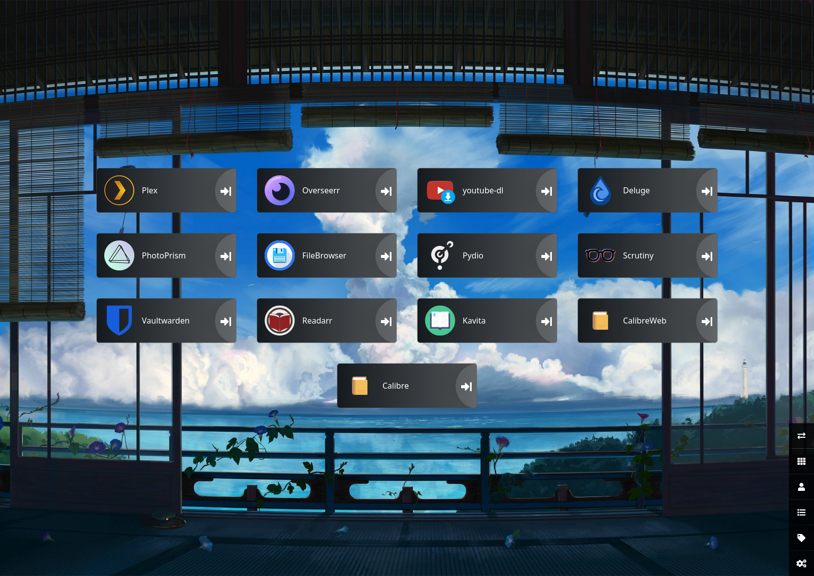

You should be able to click on the icons to get to the services.

I don't have automatic configuration set up, so if anything changes you need to manually update the dashboard.

You shouldn't need any auth to use this.

### Plex

Plex is a media server. The full extent of how to use it is outside the scope of this document.

It looks like this:

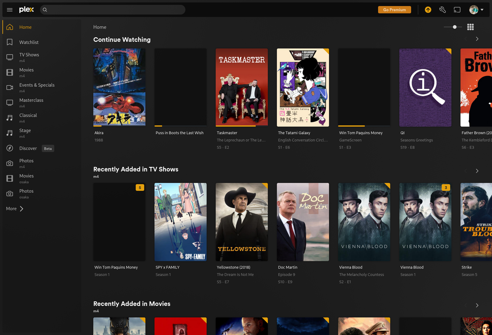

Auth should be via the plex.tv account

### Overseerr

Overseerr is a tool for requesting movies and tv shows. If you want something added, you can request it here.

With some fancy rigging we can get it to automatically search and download things, but I haven't done that yet.

It looks like this:

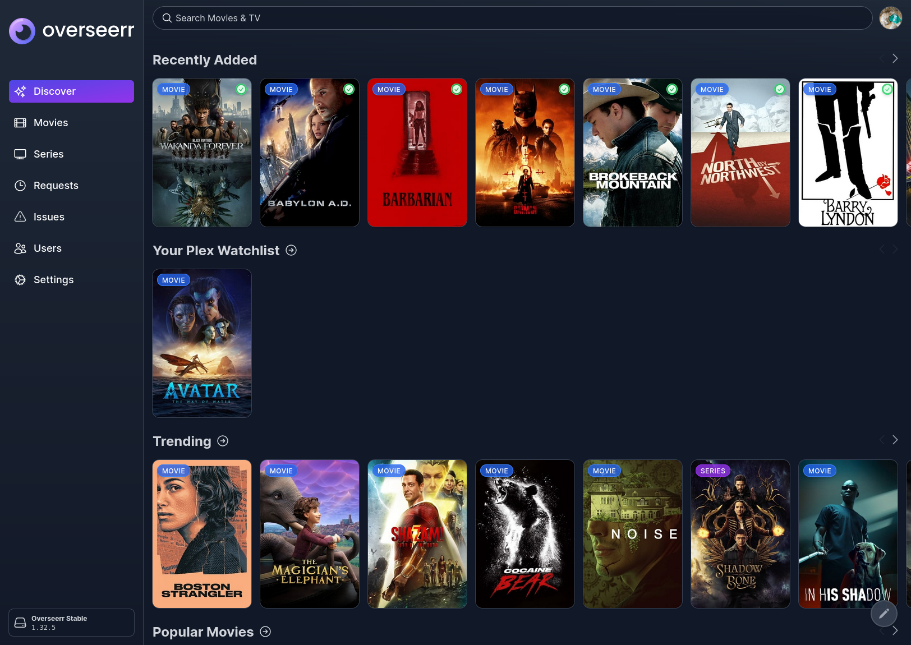

Search for something and then click the request button, and it will show up in the requests tab. From there we still have to get the file manually.

Auth works via plex.

### Metube

Appears as "youtube-dl" in heimdall.

This is set up to download videos and drop them into the "ingest" directory.

It can download a lot more than just youtube -- see https://ytdl-org.github.io/youtube-dl/supportedsites.html

It looks like this:

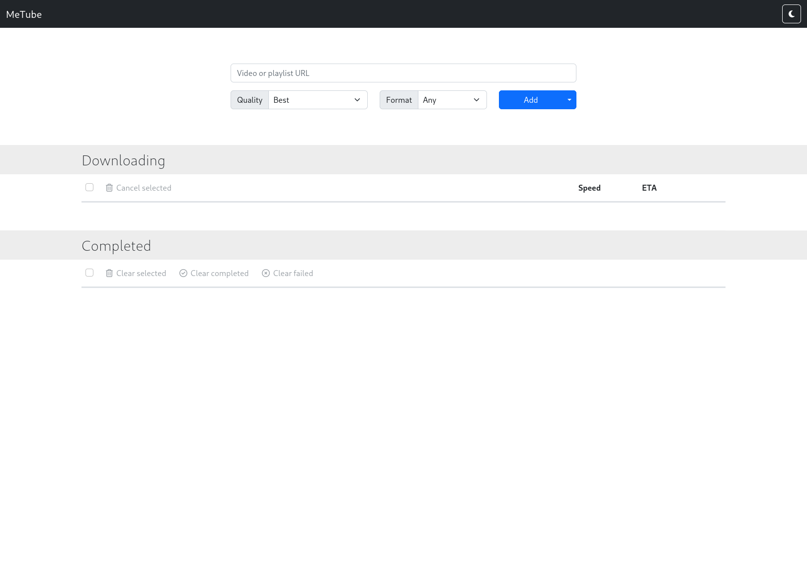

Usage should be pretty self-explanatory. No auth expected.

### Deluge

Deluge is a torrent client. It will place files in the "torrents/complete" directory

It looks like this:

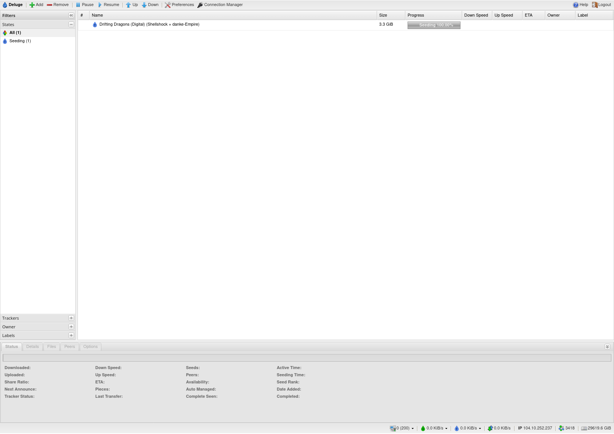

Set up with unlimited bandwidth but you should change that if it makes anything else laggy.

You can add a browser extension to make it easier to add torrents.

Auth can be found in the secrets file. Sometimes it resets to the old config imported from my machine. If that happens, see the note in the secrets file, and please set it to the proper value for the next person.

### PhotoPrism

PhotoPrism is a photo library. It will index photos in the "photos" directory.

It looks like this:

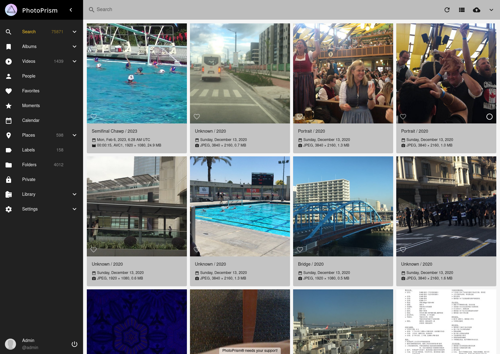

The sidebar tabs have some neat features, try them out.

It takes a while to index photos. You can manually retrigger this via the "library" tab. If you tick the "complete rescan" box it will take a few days -- mostly avoid that unless there's a reason for it.

Auth is in the secrets file.

### Filebrowser

Filebrowser exposes the full media library. Use this to do whatever random file operations.

It looks like this:

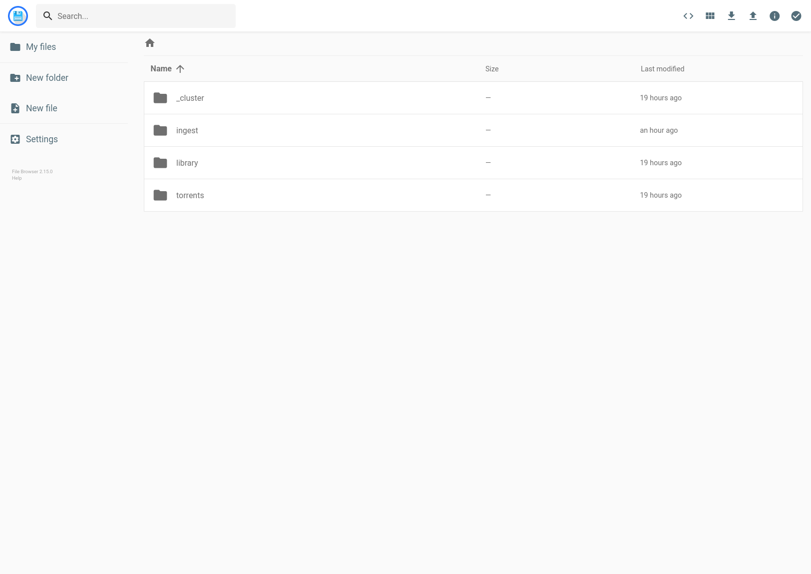

See the "Storage/Library" notes to understand directory structure here.

No auth expected, though it does have support for it and we can add it if we want.

### Pydio

Pydio is a file sharing tool. Use it to send / share files.

Theoretically it can be mapped to the drive, but that isn't set up.

It looks like this:

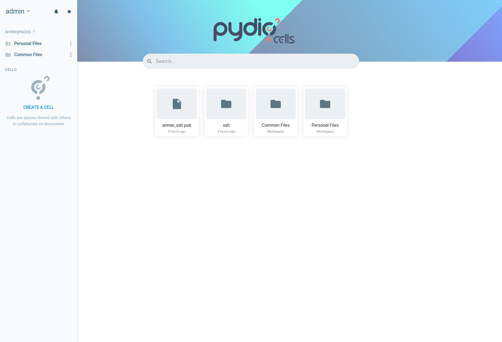

It insists on using https, but we don't have a cert for it. So you'll need to click the "advanced" button and then "proceed anyway" to get to the login screen.

Auth is in the secrets file.

### Scrutiny

Scrutiny monitors hard drive health. You should check this every now and then to make sure everything is healthy.

If it's all good, nothing to worry about. Otherwise, see section "Storage/HDDs"

It looks like this:

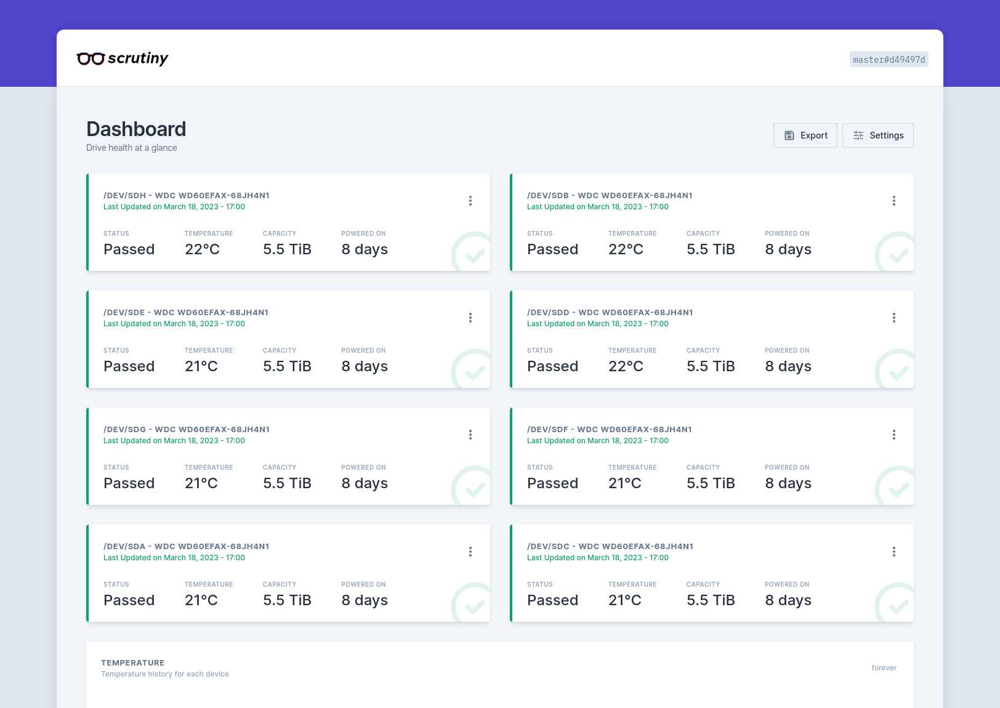

Green "passed" is good. Hitting "details" will show more S.M.A.R.T. data which are potentially useful diagnostics if you care to learn about how that all works.

No auth expected.

### Vaultwarden

Vaultwarden is a password manager. Make your own account.

You should use this to store passwords for whatever. Much better than memorizing everything.

Note: probably a good idea to keep a backup just in case. Tools --> Export Vault

It looks like this:

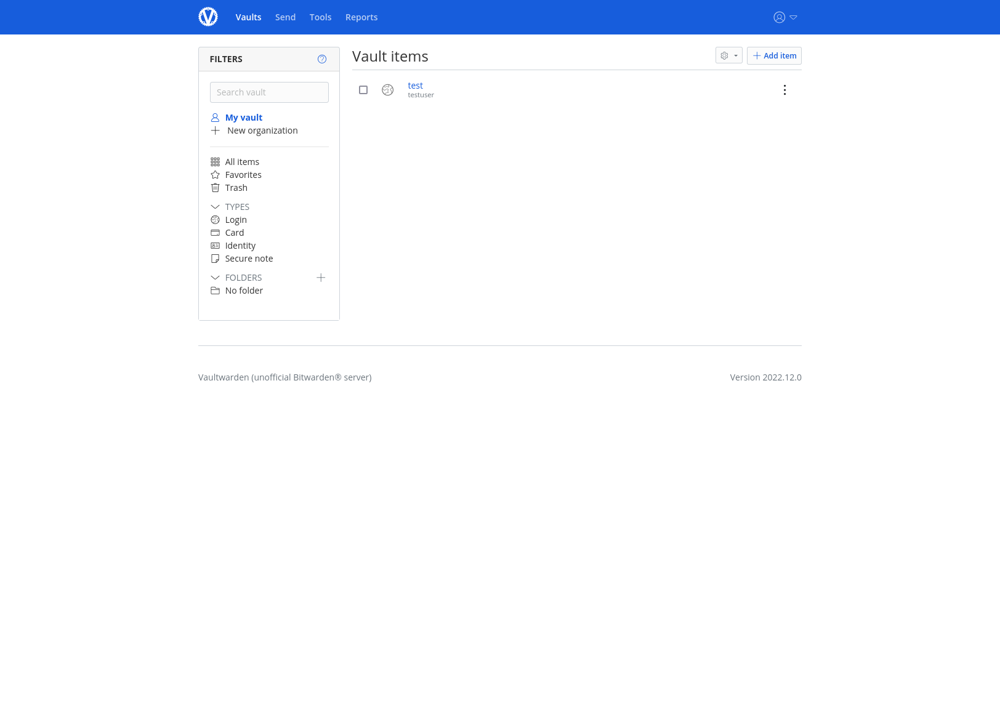

### Readarr

Readarr is a book manager (approximately?). It tries to automatically download books.

I actually don't know how to work with this program very well. Check https://wiki.servarr.com/readarr/quick-start-guide

It looks like this:

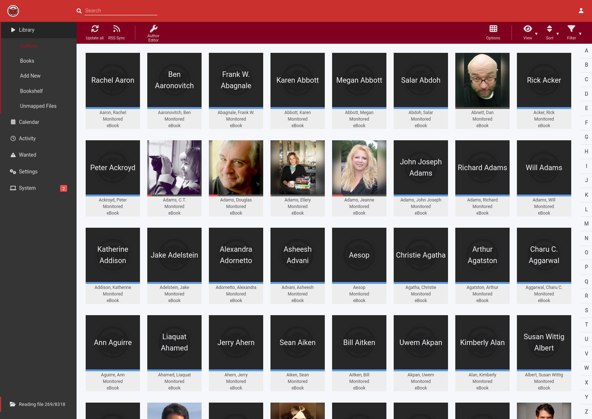

### Kavita

Kavita is a book reader. Use it when you actually want to read things.

It looks like this:

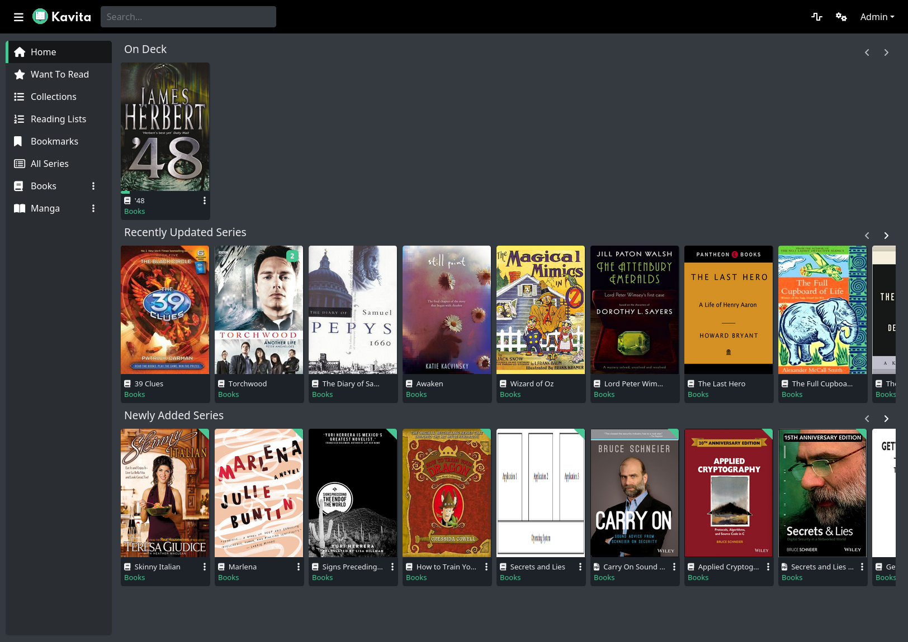

Books are in the "Books" collection, manga in the "Manga" collection.

Credentials are in the secrets file.

### Calibre

Calibre theoretically manages our book collection (?), and calibre-web lets you read books from it.

Between caibre, readarr, and kavita, I think we've got some duplicated functionality

Calibre proper uses a weird VNC web interface. You shouldn't need a login, but if you do the username is "abc" and the password should be in the secrets file.

If it asks you to configure a directory, put "/calibre".

The calibre vnc web interface looks like this:

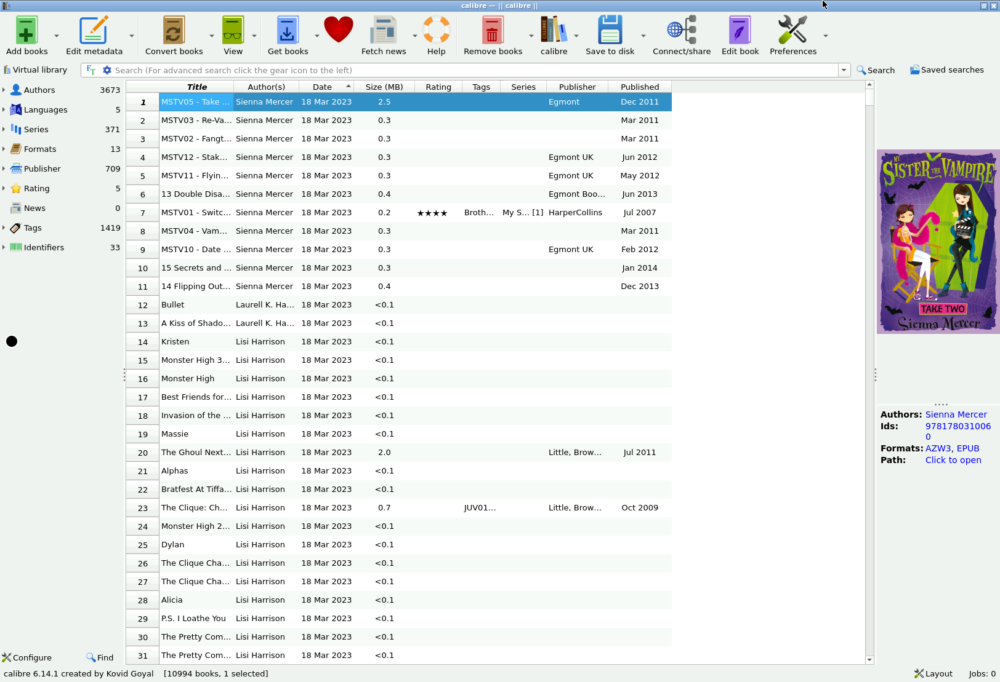

Calibre-web should be the main way you interact with calibre. It looks like this:

The credentials should be in the secrets file, but if it's uninitialized the defaults are "admin" / "admin123".

### OPNSense

OPNSense is our router and firewall. All house traffic goes through this to get to the ATT modem to the internet.

The webUI looks like:

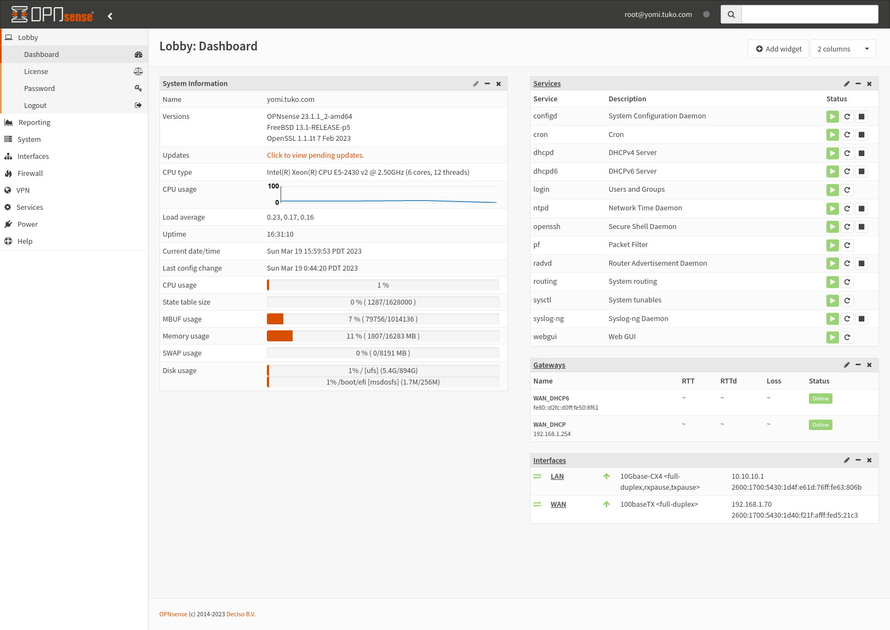

Credentials are in the ps50-techsupport. This is exposed to the internet, so don't use a weak password.

## Storage

### Library

The main storage for everything is a single zfs pool mounted on osaka at /osaka-zfs0

In this we have:

- /osaka-zfs0/_cluster
- /osaka-zfs0/ingest
- /osaka-zfs0/library
- /osaka-zfs0/torrents

_cluster is internals for the kubernetes services. Mostly you should ignore this.

ingest is where unorganized new files should go. If you've got a bunch of files, dump them here to be sorted.

library is our well-organized media library. Try to keep it neat -- get rid of random crap .ds_store + @eadir / whatever

torrents is for in progress or completed torrents. 

Files should generally be permissioned 1000:1000

### Samba

You can mount the library via samba. Your user/password credentials should be put in the secrets file.

On MacOS, press apple-k to open the "connect to server" dialog. Enter:

smb://<username>:<password>@10.10.10.3/share

(10.10.10.3 is the IP of sakaki -- see the "Hardware" section)

This will give you a network drive where you can move stuff around. Please try to avoid breaking / removing files.

### ZFS

The primary storage is a zfs pool "osaka-zfs0" mounted at /osaka-zfs0

You can check it with "zpool status" and "zpool list" on the osaka node.

We're set up with two parity drives, which means we can survive two failed drives at once without losing any data. Any more than that and all the data is gone.

### HDDs

The hard drives are all attached to osaka through a PERC H710 flashed with IT mode firmware. This means they should show up as just raw drives in osaka -- use "lsblk" to see /dev/sda through /dev/sdh

SMART data can be seen through the "scrutiny" webUI, see the "Usage" section.

We're using 8 6TB WD Reds. Osaka only has 8 3.5-inch drive slots, so if we want to expand it will probably entail setting up a SAN chassis.

If a drive fails, we'll need to replace it and "resilver" in zfs. Look up an internet guide. Any replacement drives should be the same capacity as the rest of the pool -- smaller won't work, larger will waste the extra space.

### Copying Flash Drives

If you want to copy data onto the server from a flash drive:

- plug the flash drive into osaka -- it's the bottom drive in the rack. Don't unplug the blue boot drive.
- SSH in (see "Administration/SSH")
- run "lsblk" to find the drives. It's probably /dev/sdj but look for something that has the size you're expecting.
- mount the drive or partition to /mnt/flash -- e.g. "mount /dev/sdj1 /mnt/flash"
- copy the files you want to /osaka-zfs0/ingest -- e.g. "cp -r /mnt/flash/* /osaka-zfs0/ingest" (you might need sudo)
- unmount the drive -- e.g. "umount /mnt/flash"
- unplug the flash drive
- move things to the appropriate spot in the library (see "Library")

## Hardware

### Nodes

There are four nodes in the azumanga cluster:

- yomi
- chiyo
- sakaki
- osaka

#### Yomi

Yomi is the router, running OPNSense (some weird flavor of BSD). It's statically assigned to 10.10.10.1

Caution: yomi is exposed to the bare internet, don't use weak passwords.

Yomi is configured to allow SSH traffic on port 1022, and forwards SSH on 22 to chiyo. External OPNSense WebUI access on 843, and any other traffic for services we want to expose to the net should be configured in OPNSense.

You should be able to get to OPNSense directly from the LAN at https://10.10.10.1

Yomi is a dell R320, second from the bottom of the rack. It has a small 1TB 2.5" boot/OS drive and a two-port 10G Mellanox ConnectX-3 NIC.

#### Chiyo

Chiyo is the "host" node -- if you want to go in and fiddle with things on the cluster (especially kubernetes), you should do it from here.

User "anton" has the main pulumi config files -- "/home/anton/homelab" is a git repo cloned from anton's github. 

/home/users/anton/homelab/pulumi/top/azumanga is the pulumi top-level for this custer. If you cd there and run `pulumi up` it will apply the cluster's kubernetes config.

Chiyo is the kubernetes control plane, forming a two-node cluster with sakaki. User "anton" has `kubectl` set up and configured -- see "Administration/Kubernetes" for details.

Chiyo is statically assigned to 10.10.10.2

Chiyo is a dell R320, third from the bottom of the rack. It has a 1TB 2.5" boot/OS drive and a 10G Mellanox ConnectX-3 NIC.

#### Sakaki

Sakaki is the "worker" node. It runs the majority of the kubernetes pods, which are exposed to the LAN via NodePorts.

Mostly you shouldn't actually need to do anything interesting on Sakaki.

Sakaki is statically assigned to 10.10.10.3

Since the node ports are all on Sakaki, this means most kubernetes services can be accessed directly via Sakaki's IP address.

Sakaki is a dell R620, top of the rack. It has a 1TB 2.5" boot/OS drive and a 10G Mellanox ConnectX-3 NIC, plus a random other (intel?) 2-port 1G NIC. It kinda needs a RAM upgrade -- currently 64Gb (ECC DDR3).

#### Osaka

Osaka is the storage node. It runs the zfs pool and exposes that to the cluster via NFS.

Osaka isn't part of the kubernetes cluster for safety's sake. The other nodes can go crazy, osaka needs to remain stable.

Osaka is statically assigned to 10.10.10.4

Osaka is a Dell R520 on the bottom of the rack. It has 8 3.5" drive bays which are filled with the main storage pool -- 8 6TB WD Reds. These are exposed through a PERC H710.

Since the drive bays are filled, osaka boots from a blue flash drive. Dell really really wants to boot over the network, so sometimes osaka has a bit of trouble choosing this drive at boot time. It's configured to auto-retry, but if this lasts more than an hour or so you should go downstairs and move the blue flash drive to another port. (There's no correct port, it's just that the act of moving it seems to help it get figure things out.)

The boot drive has the bare minimum "Clover" bootloader, which will load NVME drivers to boot from the *real* OS drive. That's a 1TB M.2 plugged into a PCIE riser. I've tried SATA M.2 drives but dell's firmware didn't recognize those either (in the same riser -- maybe a non-nvme pci card would help?)

Osaka has a 10G Mellanox ConnectX-3 NIC.

### Switch

The only other hardware on the rack is a 8-port 10G switch. It's a Mikrotik CRS309

The ports are SFP+ connectors, which are a bit more work to set up. Most of the network is across DAC copper cables.

If we get fiber to the rack, it should be plugged into *the second SFP+ port on yomi*, not directly to the switch. Then it will take a bit of reconfiguring to set the ports right.

### House switch

The house switch is some cisco 48-port 1GB thing, in the old rack. It branches into a bunch of patch panels, which connect to the ethernet cables running through the walls.

The 1GB here is probably the bottleneck for most of the house at this point. The mikrotik has a few more available ports, we could route a select few ethernet / fiber lines directly to there if necessary.

### Access Points

We're using TP-Link Omada EAP670's in the house. They're almost certainly not the bottleneck in any setup less that 5gbps (on the 6Ghz band). 

(6GHz is actually only supported on newer devices, I'm not sure what / how much we have and so not sure how to test the APs)

Everything is configured to use the "ps50-olive-fast" (5GHz) and "ps50-olive-slow" (2.4GHz) SSIDs, standard password. 

Why do we have "ps50-olive-slow"? Because some older devices won't see 5GHz. "ps50-olive-slow" is probably still fast enough for most anything.

To configure a new access point:

- Plug it into power and ethernet (usually the red wall ports)
- Log into OPNSense
- Go to "Services -> DHCPv4 -> Leases"
- Ctrl-f for "EAP670" and/or MAC Addresses starting with "28:87:ba" (it may take a few minutes, give it like ~10)
- Go to the matching IP address in a web browser, and log in. If it's the new AP, the default user/pass is "admin/admin". If that doesn't work, it's already configured.
- Walk through the GUI -- put the standard user/password, set the SSIDs, and that should be it.

## Administration

### SSH

SSH directly to any of the nodes on port 22. You should put a file in ~/.ssh/config with the contents:

    Host yomi
        HostName 10.10.10.1
        ProxyJump chiyo
        Port 22
        User <username>
        IdentityFile ~/.ssh/id_rsa

    Host chiyo
        HostName 10.10.10.2
        Port 22
        User <username>
        IdentityFile ~/.ssh/id_rsa

    Host sakaki
        HostName 10.10.10.3
        ProxyJump chiyo
        Port 22
        User <username>
        IdentityFile ~/.ssh/id_rsa

    Host osaka
        HostName 10.10.10.4
        ProxyJump chiyo
        Port 22
        User <username>
        IdentityFile ~/.ssh/id_rsa

Then you can just run "ssh yomi" or "ssh sakaki" etc to get into the nodes.

You'll need to get your user set up before this works. First, run:

    ssh-keygen -t ed25519

to get a public key pair. Put that in pydio and tell Anton to set you up.

### Kubernetes

Kubernetes is a container orchestration system that we use to run our web services.

Each service runs in a group of containers called a "pod". To see what's going on, first SSH into chiyo. Then you can run:

    kubectl get pods

This will show something like:

    NAME                          READY   STATUS    RESTARTS        AGE
    calibre-b8bf94fdb-mcg8w       1/1     Running   0               3h41m
    calibre-web-c78d8954d-8wj99   1/1     Running   0               115m
    deluge-79876588cb-skdg8       1/1     Running   0               3h41m
    filebrowser-77684557-fkszt    1/1     Running   0               3h41m
    heimdall-78998c86c4-r9mc8     1/1     Running   0               3h41m
    kavita-5dbcff9f48-wssf2       1/1     Running   0               3h41m
    mariadb-0                     1/1     Running   0               3h27m
    metube-66f4b4c96d-g9wsr       1/1     Running   0               3h41m
    nginx-ssl-6cbff9c755-c8q4t    1/1     Running   3 (3h40m ago)   3h41m
    overseerr-c5cdddd67-rjzw8     1/1     Running   0               3h41m
    photoprism-0                  1/1     Running   0               3h23m
    plex-6fdd5f644f-4lvxn         1/1     Running   0               3h41m
    pydio-5ff866b966-2ssgq        1/1     Running   0               3h11m
    readarr-5cc6897687-5xr6j      1/1     Running   0               3h41m
    samba-77f7dc6dfd-6klm9        1/1     Running   0               3h41m
    shell-5b956dd78c-ftrfz        1/1     Running   0               3h41m
    vaultwarden-6bf798699-kk2ln   1/1     Running   0               3h41m

If everything is Running and ready, then things are happy. Otherwise, tell Anton about the problem.

To see log files for a pod, copy-paste the name of the pod into the command:

    kubectl logs -f <pod name>

For example:

    kubectl logs -f calibre-b8bf94fdb-mcg8w

There are other kinds of kubernetes resources relevant to our setup. See https://kubernetes.io/docs/home/ for an intro.
Also https://www.cncf.io/phippy/the-childrens-illustrated-guide-to-kubernetes/

### Pulumi

Our kubernetes is managed by a configuration-as-code tool called pulumi. This git repo contains the pulumi code needed to set up everything on the cluster.

To do this:

- SSH into chiyo
- su into "anton"
- cd into /home/anton/homelab/pulumi/top/azumanga
- run "pulumi up"

It will inspect the current state of the cluster, and make changes to bring it into line with the configuration. This usually takes a while (~minutes).

